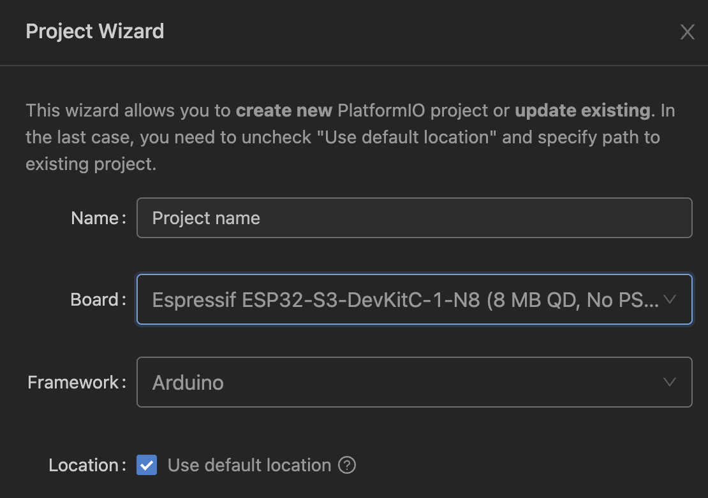

# Template for m5stack coreS3

## Overview

・M5stack coreS3 template, based on m5unified's [How to get started with M5Unified library](https://docs.m5stack.com/en/quick_start/m5unified/helloworld).
・Note that m5unified still does not seem to be compatible with coreS3.(2023.06.01)

## PlatformIO setting

## References

・[M5Unified](https://github.com/m5stack/M5Unified)
